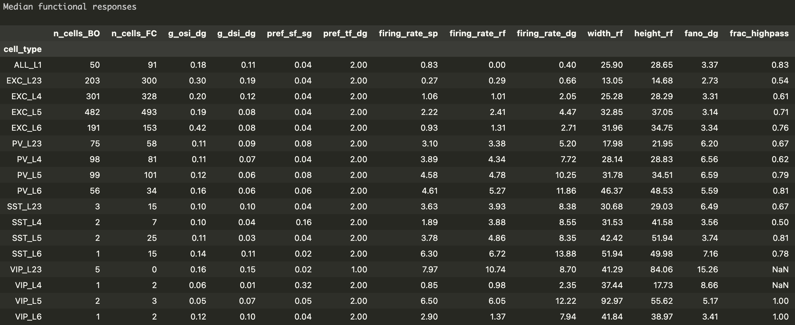

# V1 functional property table (version 1.2)
Functional properties of different cell types in the primary visual cortex (V1) derived from the Allen Institute extracellular electrophysiology (Neuropixels) data

Please look at 'cortical_metric_table.ipynb' to see how the table is generated.

## Example table (median)

n_cells_BO: Number of cells in 'Brain Observatory' sessions

n_cells_FC: Number of cells in 'Functional Connectivity' sessions

g_osi_dg: Global OSI (orientation selectivity index) for drifting gratings

g_dsi_dg: Global DSI (direction selectivity index) for drifting gratings

pref_sf_sg: Preferred spatial frequency for static gratings (cycles / °)

pref_tf_dg: Preferred temporal frequency for drifting gratings (Hz)

firing_rate_sp: Population average of the firing rates during the first spontaneous activity segment in the session that is longer than 200 s. (Hz)

firing_rate_rf: Population average of the firing rates during the entire duration of the Gabor patch stimulus (receptive field measurement) (Hz)

firing_rate_dg: Population average of the firing rates during the entire duration of the drifting gratings stimulus (Hz)

width_rf: Horizontal width of the receptive field (°)

height_rf: Vertical height of the receptive field (°)

fano_dg: Fano factor for a preferred pattern of drifting gratings

frac_highpass: fraction of cells that prefer high-contrast stimulus

## Methods

The cells were categorized by the cortical layer, waveforms and opto-taggings.

The layer information is taken from the repository of Neuropixels platform paper
(https://github.com/AllenInstitute/neuropixels_platform_paper/tree/c29e59abedebe5f1f4f20739fe02c95f29d4556d)

The neurons' waveforms were separated into broad spikes and narrow spikes (using
the waveform on the maximum amplitude channel; PCA + Mixture of Gaussians clustering).
Neurons with broad spikes without opto-tagging were considered as excitatory neurons.
Neurons with narrow spikes without opto-tagging were considered as PV neurons.

When the neurons were opto-tagged, they were classified accordingly to the type of
the cre-line (PV, SST, VIP).
Because SST and VIP cells were small populations, we used both V1 and non-V1 opto-tagged
neurons. PV and excitatory neurons were exclusively from V1.

The table shown here is ony a small subset of availble features. For full feature set,
please run the notebook and edit features to extract. Detailed descriptions of the data
are available at ECEphys website (https://allensdk.readthedocs.io/en/latest/visual_coding_neuropixels.html).

Width and weight that exceed 100° are ignored because they may be of the neurons
without a clear receptive field.

Contrast response analysis is done similarly to the one introduced in
Millman et al., eLife 2020 (https://elifesciences.org/articles/55130). Namely, the
responses to contrast was fit with 3 different models (rising sigmoid (high-pass),
falling sigmoid (low-pass), and a product of rising and falling sigmoids (band-pass)) and used
Akaike Information Criterion (AIC) to determine which model best explains the response.

The code used for the above analysis are also included in the 'misc' folder, but they are
not particularly well-documented (reference only). Please contact me for clarifications.
